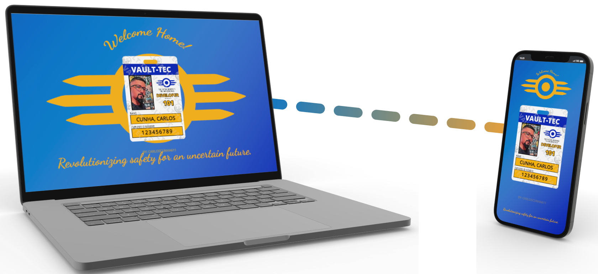

<h1 align="center"> Vault-Tec Card</h1>

Projeto pessoal

  <a href="#-Funcionalidades">Funcionalidades</a>&nbsp;&nbsp;&nbsp;|&nbsp;&nbsp;&nbsp;
  <a href="#-layout">Layout</a>&nbsp;&nbsp;&nbsp;|&nbsp;&nbsp;&nbsp;
  <a href="#-Tecnologias">Tecnologias</a>&nbsp;&nbsp;&nbsp;|&nbsp;&nbsp;&nbsp;
  <a href="#-Links">Links</a>&nbsp;&nbsp;&nbsp;|&nbsp;&nbsp;&nbsp;

# 💻 Funcionalidades

◾ Click no card para virar
◾ Responsividade

## ▶ Demonstração

  

> O Vault-Tec Card mostra seu cartão de idenficação na impresa vault.

# 🎨 Layout

 Você pode visualizar o layout clicando no figma.

# ⚙ Tecnologias

   

# 🔗 Links

<a href = "https://t.me/Carloscunha611"> 

---

◾ By: carloscunha611 ◾
